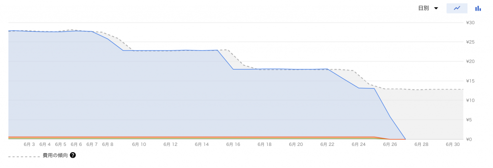
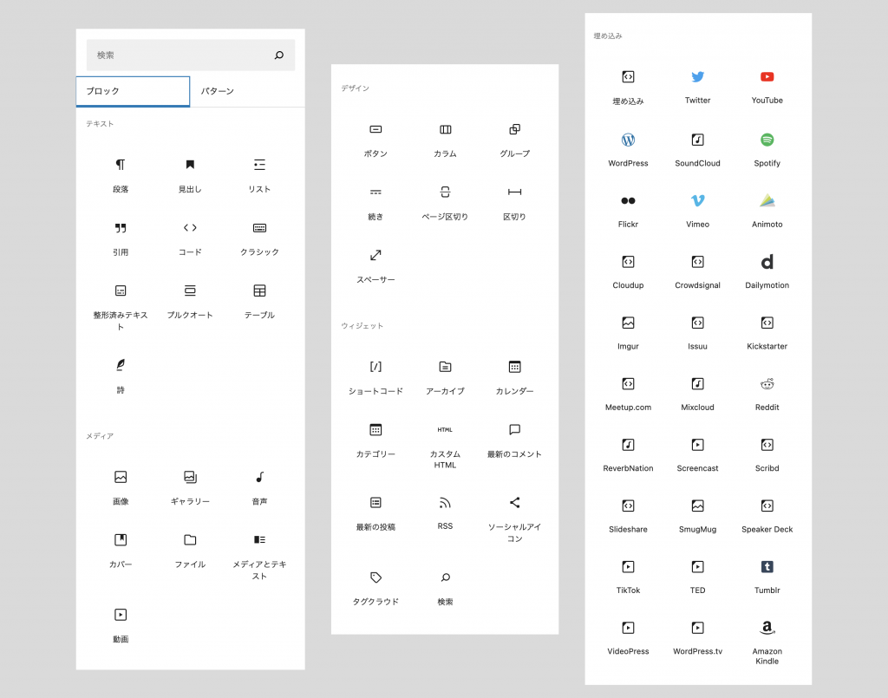

2ヶ月程前に本ブログをNetlifyにホスティングしたGatsbyから、GCE(Google Compute Engine)にホスティングしたWordPressをVercel上のNext.jsからWP REST APIを叩いて使う構成に移行してみました。その内容については前回の記事をどうぞ。

[https://sixaxd.com/posts/110](https://sixaxd.com/posts/110)

前回の記事でも軽く言及していたのですが、管理画面的に使うだけとはいえWordPressをGCEで動かすとどれくらい料金がかかるんだろうなぁという所が若干不安だったりしました。

ブログを動かしてみて少し時間も経ったのでそこら辺について書いてみようと思います。

## いま現在かかっている費用

前回の記事だとVMインスタンスの立ち上げ時にe2-microを選択していたのですが、途中からf1-microに変更してインスタンスのスペックを下げています。

前回はあまりスペックを下げすぎて問題が発生しても嫌だなと思ったので、デフォルト設定であるe2-microを選択していたのですが、f1-microに変更後も現状特に問題なくサクサクとWordPressは動作しています。

マシンタイプやその料金体系についての詳しい内容は以下の通り。

[https://cloud.google.com/compute/vm-instance-pricing?hl=ja](https://cloud.google.com/compute/vm-instance-pricing?hl=ja)

[https://cloud.google.com/compute/docs/machine-types?hl=ja#e2\_shared-core\_machine\_types](https://cloud.google.com/compute/docs/machine-types?hl=ja#e2_shared-core_machine_types)

そして、実際にいまこのブログのCMSを担っているWordPress（が動いているGCE）にかかっている費用は以下のスクリーンショットの通りで毎月600円程度です。4月はe2-microで動かしている期間が長かったので少しお高めで、900円くらいかかっていますね。

なのですが、おそらくもう少し費用は下がりそうな気がしていて、もう少し時間が経つと300円〜400円前後で落ち着くのではないかと予想しています。

というのも、GCEには継続利用割引というものがあり、継続的に利用していると以下のスクリーンショットのようにだんだんと料金が下がっていきます。いまは1日あたり13円に落ち着いていますね。

また、実際今回のような技術構成でいく場合、クライアントワークなら概ねVercelはPro Planにしなければならないので（商用利用にあたる場合がほとんどだと思うので）、プラス毎月約2000円かかります。

[https://vercel.com/pricing](https://vercel.com/pricing)

あとはWordPressの本体となるサイトへのアクセスが増えるとインスタンスの稼働時間が増えてしまうので、その分でGCEの料金が増えてしまうパターンもありそうです。

こちらのサイトについては基本noindexにして検索エンジンからの流入はなくし、インスタンスに負荷をなるべくかけないようにWordPressが動作する最小限のテーマ（functions.php, index.php, style.cssの3つだけで構成された無のテーマ）を利用することで稼働時間は抑えられる気がします。

ただ、実際どれくらい変わるのかよく分かっていないので意味ない事をしているかもしれない。Next.jsのISRの関係で本サイトにアクセスされた際にWordPressにリクエストを飛ばしているような気もするしどうなんでしょう。

そもそも根本的なアクセスを抑制するには色々と考える必要があります。

それは主にこのサイトのURLをなるべく知られないようにする対策と不審なリクエストを抑制する対策になると思いますが、前者については、WP REST APIに一回どこか異なるAPIを介してリクエストするにしても、画像のことなど考えるとちょっと面倒そう（画像のURLでCMSのドメインが分かる）ですね。

後者はとりあえず簡易的に対策するならGCPのファイアウォール設定（Vercelの都合上IP制限などは出来ないはず）、もう少しちゃんとするならGoogle Cloud Armorなど使用してWAFを設定する感じでしょうか。……ここまでするべきなのかは状況によりそうですが、WordPressのプラグインでセキュリティを強化するのは簡単にできるのでやっておいた方が良いかもです。（[All In One WP Security & Firewall](https://ja.wordpress.org/plugins/all-in-one-wp-security-and-firewall/) など）

気になる部分はまだ存在するものの、まとめると、**月あたり約2400円**（VercelのPro Planを利用しないなら約400円）程度のランニングコストになりそうです。

ついでに今回のようなモチベーションで作るブログを、その他の技術スタックで実現しようとした時にかかる費用はどうなるのか軽く調べてみました。

## WordPressを動かすバックエンド自体を高速化する

WordPressの高速化をフロントエンド以外でどのように行うのかあまり詳しくないのですが、VPSにKUSANAGIを導入するのはよくある1つのパターンなのかなと思います。たぶん。

[https://kusanagi.tokyo/](https://kusanagi.tokyo/)

カゴヤ・ジャパンのWordPress専用サーバーだと440円から利用できたりするようですが、KUSANAGIの推奨スペックとしてメモリ4GB以上というものが挙げられているので、それにあてはめるとグレード4（メモリ2G, 4400円）くらいは欲しい雰囲気があります。

[https://www.kagoya.jp/wordpress/lp/](https://www.kagoya.jp/wordpress/lp/)

さくらインターネットのVPSだと、2GBで1738円〜、4GBで3520円〜なのでカゴヤよりお得そうです。

[https://vps.sakura.ad.jp/](https://vps.sakura.ad.jp/)

ConoHaだと4GBで2901円なので更にお得でした。

[https://www.conoha.jp/vps/kusanagi/](https://www.conoha.jp/vps/kusanagi/)

VPS+KUSANAGIでは無いですがKinstaとかも良さそうです。こちらはスタータープランで$30、約3000円くらいですね。

[https://kinsta.com/jp/](https://kinsta.com/jp/)

メモリと金額しか見ていない雑な比較ですが、**3000〜4000円程度**はかかりそうです。

## WordPress以外のCMSを使う

件のHeadless CMSですね。

前回記事にも書いたように日本語に対応しているのはmicroCMSだけ……と思っていたのですが、先日こちらのプレスリリースでKurocoというCMSを知りました。

[https://prtimes.jp/main/html/rd/p/000000011.000031546.html](https://prtimes.jp/main/html/rd/p/000000011.000031546.html)

実際に触っていないので使い心地などは全然わからないですが、ドキュメントを見る限り権限管理など含め機能はかなり充実していそうです。

従量課金の内訳を見る限り、Next.js + Vercelなどによりサイトを静的生成するならかなり安く済みそうというかおそらく無料の範囲に収まると思います。気になりますね。

[https://kuroco.app/documentations/about/](https://kuroco.app/documentations/about/)

microCMSは冒頭にも書いた通り権限管理しようとするとかなりお高めです。ただ、そこの必要性が薄いのであれば、無料のHobbyプランでも十分活用できると思います。

[https://microcms.io/pricing](https://microcms.io/pricing)

ただ、以下のよくある質問の回答を読むと法人はStandardプラン以降を使うべきな気がしてきます。

[https://document.microcms.io/faq/free-plan-to-paid-plan](https://document.microcms.io/faq/free-plan-to-paid-plan)

こちらもVercelの料金をプラスすることになる（Vercelでなければ更に値段を抑える方法もあるとは思います）ので、概ね本記事の技術スタックの料金と変わらなそうです。

## あとがき

料金が同じなのであればなぜWordPressを使うのか？という所をよく考えてみると、別に他のCMSでも良かったというパターンは普通にありそうです。

今回は日本語対応や権限管理の都合でWordPressを考えていましたが、Kurokoが良さげならそれでも良いかもしれない。リリースしたてなので実際のクライアントワークで利用する判断をするかは微妙なところではありますが……。

他のWordPressのメリットとしては、既にWordPressで構築されたサイトの記事移行が楽、WordPressでの入稿に慣れているのでCMSを変えたくないという要望への対応、ブログに特化したデータが設定不要で既にAPIで提供されている……トップ記事、アイキャッチ画像、カテゴリー、タグ、抜粋など。

あとは、Gutenbergというブロックエディターがかなり完成されているのもあります。

以下のコンテンツがエディター上では利用できますが、これらが全てNext.jsで上手く動くのかは全く検証していないので分かりません。動くと良いですね。

こんな事を色々考えていると、そもそもNext.js + Vercelの体験がユーザー的にもエンジニア的にも良いのでそちらに移りたいね〜という根底のモチベーションを忘れそうです。

WordPressを使ったWebサイト開発は正直言ってやばツラい！

ので、何年もずっとWordPressしか使っていないWeb制作会社はこのような方法も徐々に採用していけると良いのかなと思います。みんなで幸せになろう。
